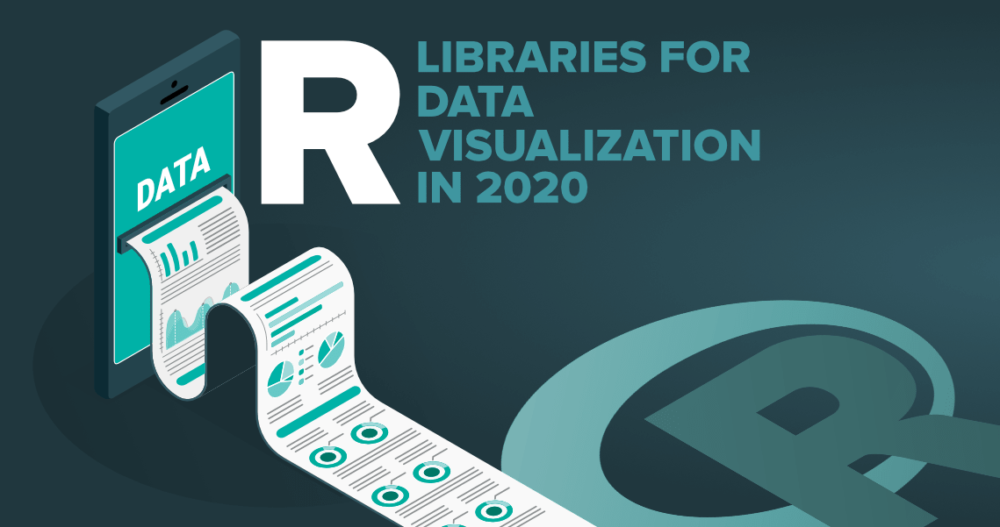

---

@title[Notes]


A Gentle Intro to **```ggplot2```**</br></br></br></br></br></br></br></br>


@snap[east span-45]

@snapend
---
## What will you learn today?

---
@title[Add A Little Imagination]

@snap[north-west span-50 text-center]
#### What will you learn today
@snapend

@snap[west span-55]
@ul[list-spaced-bullets text-09]
- Produce scatter plots, boxplots using ```ggplot2```/
- Describe properly the entire process to create visualisation in R
- Build complex and customized plots from data in a dataframe
@ulend
@snapend

@snap[east span-45]

@snapend
---

## Why is it Important?
@snap[east span-45]

@snapend
> "The simple graph has brought more information to the data analyst’s mind than any other device." --- John Tukey

---

### My personal reasons
* Functional data visualization
	* Wrange data
	* Map data to visual elements
	* Tweak scales, guides, axis, labels, theme
	* Easy to reason about how data drives visualization
	* Easy to iterate
	* Easy to be consistent

---

### What are we getting into?
---


@snapend

@snap[west span-55]
@ul[list-spaced-bullets text-09]
- is a huge package: tons of functions....but it's very well organized
- You will know _where_ and _what_ to look for
- Build complex and customized plots from data in a dataframe
@ulend
@snapend

@snap[east span-45]

@snapend

---

@snap[north-east span-100 text-pink text-06]
Let your code do the talking!
@snapend

```r zoom-18
# install necessary packages
library(tidyverse)
# import data inputs
interviews_plotting <- read_csv("data_output/interviews_plotting.csv")
```

@snap[south span-100 text-gray text-08]
@[1-2](You can step-and-ZOOM into fenced-code blocks, source files, and Github GIST.)
@[3,4, zoom-13](Using GitPitch live code presenting with optional annotations.)
@snapend


---

@snap[north-east span-100 text-pink text-06]
If you hanve't done yet!
@snapend

```r zoom-8
interviews_plotting <- interviews %>%
## pivot wider by items_owned
separate_rows(items_owned, sep = ";") %>%
## if there were no items listed, changing NA to no_listed_items
replace_na(list(items_owned = "no_listed_items")) %>%
mutate(items_owned_logical = TRUE) %>%
pivot_wider(names_from = items_owned, 
            values_from = items_owned_logical, 
            values_fill = list(items_owned_logical = FALSE)) %>%
## pivot wider by months_lack_food
separate_rows(months_lack_food, sep = ";") %>%
mutate(months_lack_food_logical = TRUE) %>%
pivot_wider(names_from = months_lack_food, 
            values_from = months_lack_food_logical, 
            values_fill = list(months_lack_food_logical = FALSE)) %>%
## add some summary columns
mutate(number_months_lack_food = rowSums(select(., Jan:May))) %>%
mutate(number_items = rowSums(select(., bicycle:car)))
```
@snapend

---

---

@snap[north-east span-100 text-pink text-06]
Let your code do the talking!
@snapend

```r zoom-18
<DATA> %>%
    ggplot(aes(<MAPPINGS>)) +
    <GEOM_FUNCTION>()
```

@snap[south span-100 text-gray text-08]
@[1](You can step-and-ZOOM into fenced-code blocks, source files, and Github GIST.)
@[2-3, zoom-13](Using GitPitch live code presenting with optional annotations.)
@snapend


---

@snap[north-east span-100 text-pink text-06]
Let your code do the talking!
@snapend

```r zoom-18
# This is the correct syntax for adding layers
interviews_plot + 
geom_point()

# This will not add the new layer and will return an error message
interviews_plot
+ geom_point()
```

@snap[south span-100 text-gray text-08]
@[1-2](You can step-and-ZOOM into fenced-code blocks, source files, and Github GIST.)
@[2-3, zoom-13](Using GitPitch live code presenting with optional annotations.)
@snapend

---


---?image=assets/img/code.jpg&opacity=60&position=left&size=45% 100%

@snap[east span-50 text-center]
## Now It's **Your** Turn
@snapend

@snap[south-east span-50 text-center text-06]
[Download GitPitch Desktop @fa[external-link]](https://gitpitch.com/docs/getting-started/tutorial/)
@snapend

