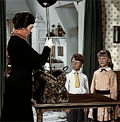

---

@title[Notes]

@snap[west span-75]
@ul[list-spaced-bullets text-09]
A Gentle Intro to **```ggplot2```** </br></br></br></br></br>
@snap[east span-55]

@snapend

---
## What will you learn today?

---
@title[Add A Little Imagination]

@snap[north-west span-50 text-center]
#### You'll know how to:
@snapend

@snap[west span-55]
@ul[list-spaced-bullets text-09]
- Produce scatter plots, boxplots using ```ggplot2```. </br>
- Describe properly the entire process to create visualisation in R. </br>
- Build complex and customized plots from data in a dataframe. </br>
@ulend
@snapend

@snap[east span-45]

@snapend
---

## Why is it Important?

---

> "The simple graph has brought more information to the data analyst’s mind than any other device."
@ulend

@snapend

---

### My personal reasons
* Functional data visualization
	* Wrange data
	* Map data to visual elements
	* Tweak scales, guides, axis, labels, theme
	* Easy to reason about how data drives visualization
	* Easy to iterate
	* Easy to be consistent

---

## What are we getting into?

---
@snap[east span-45]

@snapend
@snap[south span-100]
ggplot2 as a lovely package for data visualisation
@snapend
---
@snapend

@snap[west span-100]
@ul[list-spaced-bullets text-09]
Its a huge package: tons of functions....but it's very well organized
@snap[east span-45]

@snapend
---

You will know _where_ and _what_ to look for
@snap[east span-100]

@snapend

---
and build complex and customized plots from data in a dataframe
@ulend

@snapend
---
@snap[north-east span-100 text-pink text-06]
Let your code do the talking!
@snapend

```r zoom-18
# install necessary packages
library(tidyverse)
# import data inputs
interviews_plotting <- read_csv("data_output/interviews_plotting.csv")
```

@snap[south span-100 text-gray text-08]
@[1-2](You can step-and-ZOOM into fenced-code blocks, source files, and Github GIST.)
@[3,4, zoom-13](Using GitPitch live code presenting with optional annotations.)
@snapend


---


@snap[north-east span-100 text-pink text-06]
Getting started with ```ggplot2```
@snapend

```r zoom-18
<DATA> %>%
    ggplot(aes(<MAPPINGS>)) +
    <GEOM_FUNCTION>()
```

@snap[south span-100 text-gray text-08]
@[1](You can step-and-ZOOM into fenced-code blocks, source files, and Github GIST.)
@[2-3, zoom-13](Using GitPitch live code presenting with optional annotations.)
@snapend


---

@snap[north-east span-100 text-pink text-06]
Examples of what will you achieve to make today in R!
@snapend

```r zoom-18
interviews_plotting %>%
ggplot(aes(x = no_membrs, y = number_items)) +
geom_point()
```
?image=assets/img/graph1.png&opacity=60&position=right&size=15% 20%

---

@snap[east span-50 text-center]
## Now It's **Your** Turn
@snapend

@snap[south-east span-50 text-center text-06]
[Download GitPitch Desktop @fa[external-link]](https://gitpitch.com/docs/getting-started/tutorial/)
@snapend

