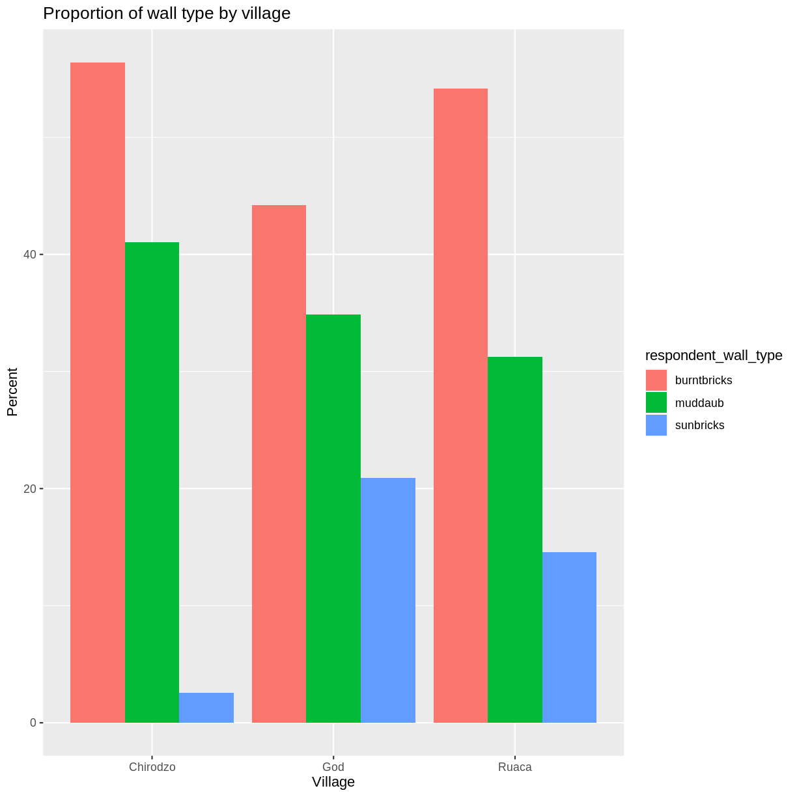

---
## A reward for all the hard work </br></br></br></br> 
@title[Notes]

@snap[east span-5 text-center]

@snapend

@snap[north-east span-100 text-pink text-06]
Slides and code here

---
## What will you learn today?

---
@title[Add A Little Imagination]

@snap[north-west span-50 text-center]
#### You'll know how to:
@snapend

@snap[west span-55]
@ul[list-spaced-bullets text-09]
- Produce **plots** using ```ggplot2```. </br>
- Describe properly the entire **process** to create visualisation in R. </br>
- Build complex and customized plots from **data** in a dataframe. </br>
@ulend
@snapend

@snap[east span-45]

@snapend
---

## Why is it Important?

---

> "The simple graph has brought more information to the data analyst’s mind than any other device. - *John Tukey*"
@ulend

@snapend

---
### IMHO....
* **Functional** data visualization
	1. Wrange data
	2. Map data to visual elements
	3. Tweak scales, guides, axis, labels, theme
* Easy to **reason** about how data drives visualization
* Easy to **iterate**
* Easy to be **consistent**
@snap[north-east span-100 text-pink text-06]

---

## What are we getting into?

---
@snap[east span-50]

@snapend
@snap[south span-100]
**ggplot2** as a lovely package for **data visualisation**
@snapend
---
@snap[east span-50]

@snapend
@snap[south span-100]
Tons of arguments but very well organized
@snapend
---
---

You will know **where** and **what** to look for
@ulend

@snapend

---
and build complex and customized plots from data in a dataframe
@ulend

@snapend
---
@snap[north-east span-100 text-pink text-06]
Getting started with ```ggplot2```
@snapend

```r zoom-8
<DATA> %>% 
    ggplot(aes(<MAPPINGS>)) +
    <GEOM_FUNCTION>()
```

@snap[south span-100 text-blue text-08]
@[1](Remember R expect inputs before **pipe** operators)
@[2-3, zoom-13](Specific arguments for ggplot such  geom_point())
@snapend


---

## what will you achieve to make today in R!
---
@snap[north-east span-100 text-pink text-06]
Scatter plot with simple features
@snapend

```r zoom-8
interviews_plotting %>%
    ggplot(aes(x = no_membrs, y = number_items)) +
    geom_point()
```

@snap[south span-100 text-blue text-08]
@[1](Adding the input data)
@[2](Adding variables in axis)
@[3](Drawing the plot as a dot plot)
@snapend

@snap[east span-35]

@snapend
---
@snap[north-east span-100 text-pink text-06]
Scatter plot with geom_count()
@snapend

```r zoom-8
# my first plot with x and y variables
interviews_plotting %>%
ggplot(aes(x = no_membrs, y = number_items, color = village)) +
geom_count()
```

@snapend

@snap[east span-35]

@snapend
---
@snap[north-east span-100 text-pink text-06]
Barplot adding labels and titles
@snapend

```r zoom-8
percent_wall_type %>%
    ggplot(aes(x = village, y = percent, fill = respondent_wall_type)) +
    geom_bar(stat = "identity", position = "dodge") +
    labs(title = "Proportion of wall type by village",
         x = "Village",
         y = "Percent")
```

@snapend

@snap[east span-35]

@snapend

---
@snap[north-east span-100 text-pink text-06]
Let your code do the talking!
@snapend

```r zoom-8
# install necessary packages
library(tidyverse)
# import data inputs
interviews_plotting <- read_csv("data_output/interviews_plotting.csv")
```

@snap[south span-100 text-gray text-08]
@[1-2](You can start insalling the library)
@[3,4, zoom-13](Using today morning dataset)
@snapend
---


@snap[east span-50 text-center]
## Now It's **Your** Turn
@snapend

@snap[south-east span-50 text-center text-06]
[Download Slides and Code](https://github.com/carlosug/in-data-carpentry-slides)
@snapend

---